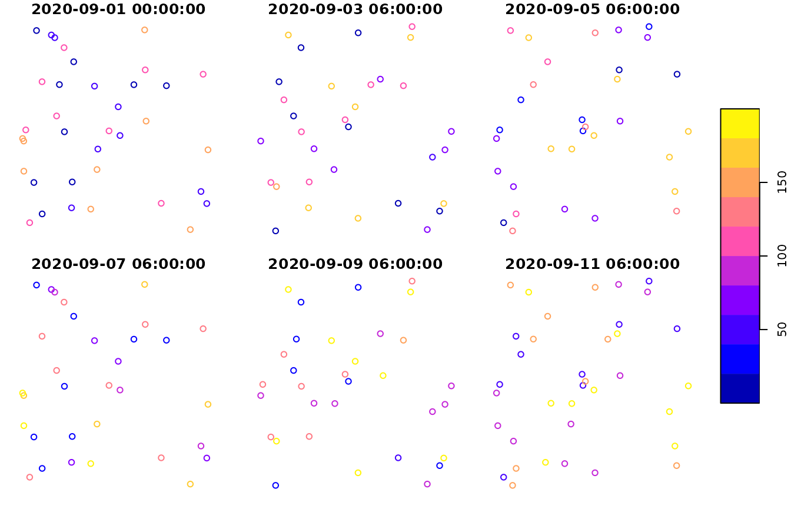
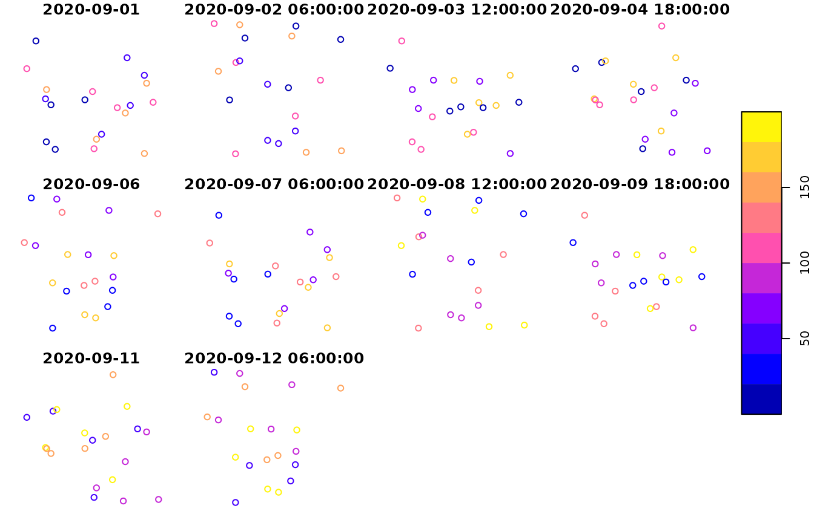
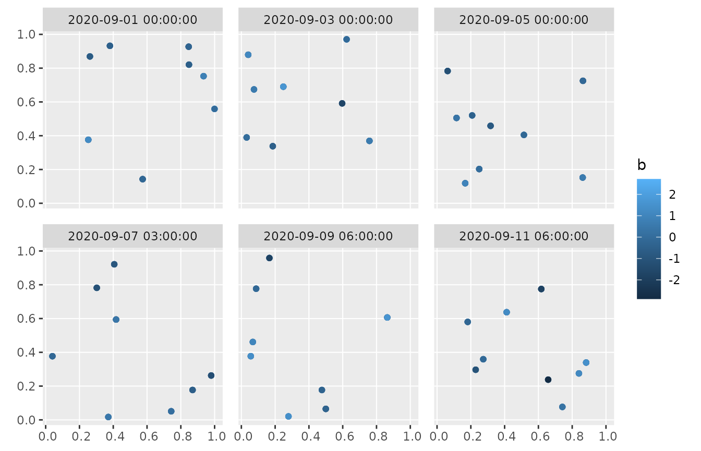
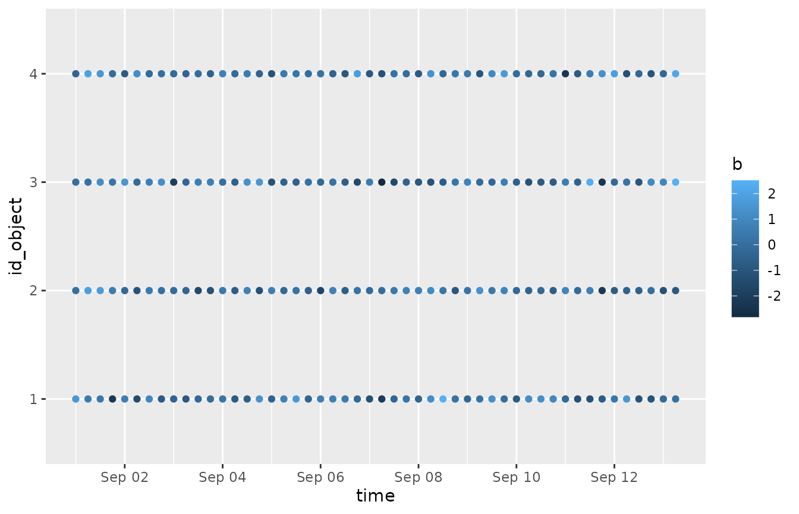
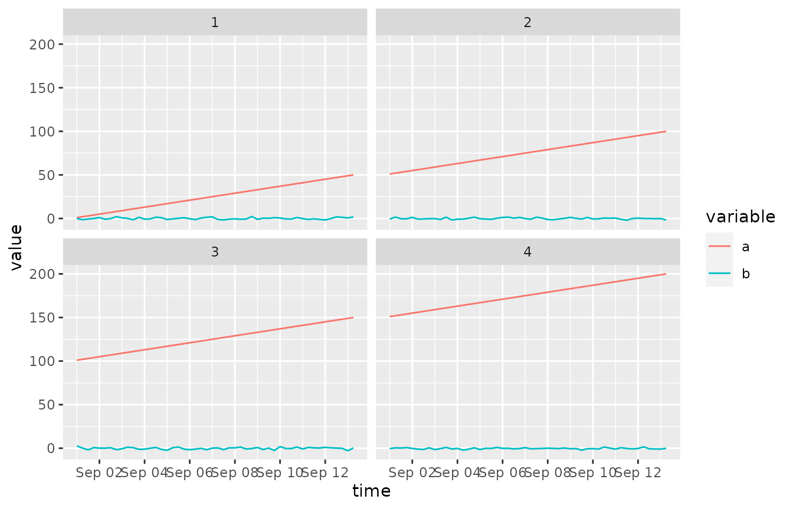
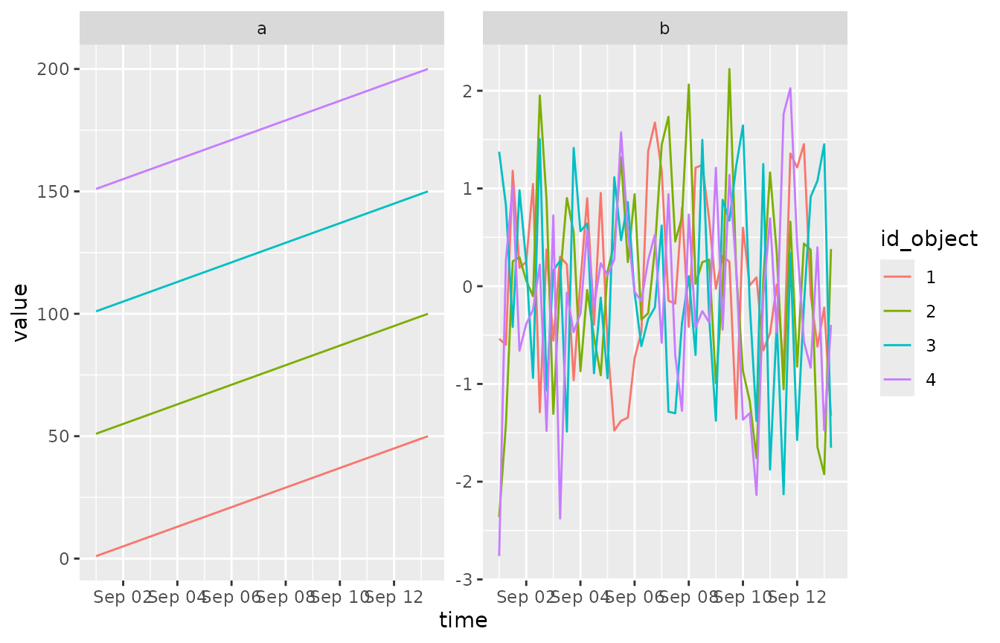

# Introduction to sftime

The package `sftime` extends package `sf` to store and handle
spatiotemporal data. To this end, `sftime` introduces a dedicated time
column that stores the temporal information alongside the simple
features column of an `sf` object.

The time column can consists of any collection of a class that allows to
be sorted - reflecting the native order of time. Besides well-known time
classes such as `Date` or `POSIXct`, it also allows for custom class
definitions that come with the necessary methods to make sorting work
(we will see a example below).

This vignette briefly explains and illustrates the ideas and decisions
behind the implementation of `sftime`.

``` r

# load required packages
library(sftime)
#> Loading required package: sf
#> Linking to GEOS 3.12.1, GDAL 3.8.4, PROJ 9.4.0; sf_use_s2() is TRUE
library(sf)
library(stars)
#> Loading required package: abind
library(spacetime)
library(ggplot2)
library(tidyr)
```

## The `sftime` class

An `sftime` object is an `sf` object with an additional time column that
contains the temporal information alongside the simple features column.
This allows it to handle irregular and regular temporal information.

For spatiotemporal data with regular temporal data (raster or vector
data cubes: data where each geometry is observed at the same set of time
instances), package `stars` is developed as a powerful alternative
(e.g. time series of remote sensing imagery, regular measurements of
entire measurement network). `sftime` fills the gap for data where
arbitrary combinations of geometry and time occur, including irregularly
collected sensor data or (spatiotemporal) point pattern data.

`sftime` objects can be constructed directly from `sfc` objects by
combining them with a vector representing temporal information:

``` r

# example sfc object
x_sfc <- 
  sf::st_sfc(
    sf::st_point(1:2), 
    sf::st_point(c(1,3)), 
    sf::st_point(2:3), 
    sf::st_point(c(2,1))
  )

# create an sftime object directly from x_sfc
x_sftime1 <- sftime::st_sftime(a = 1:4, x_sfc, time = Sys.time()- 0:3 * 3600 * 24)

# first create the sf object and from this the sftime object
x_sf <- sf::st_sf(a = 1:4, x_sfc, time = x_sftime1$time)
x_sftime2 <- sftime::st_sftime(x_sf)

x_sftime3 <- sftime::st_as_sftime(x_sf) # alernative option

identical(x_sftime1, x_sftime2)
#> [1] TRUE
identical(x_sftime1, x_sftime3)
#> [1] TRUE

x_sftime1
#> Spatiotemporal feature collection with 4 features and 1 field
#> Geometry type: POINT
#> Dimension:     XY
#> Bounding box:  xmin: 1 ymin: 1 xmax: 2 ymax: 3
#> CRS:           NA
#> Time column with classes: 'POSIXct', 'POSIXt'.
#> Ranging from 2026-05-04 20:03:06.910009 to 2026-05-07 20:03:06.910009.
#>   a       x_sfc                time
#> 1 1 POINT (1 2) 2026-05-07 20:03:06
#> 2 2 POINT (1 3) 2026-05-06 20:03:06
#> 3 3 POINT (2 3) 2026-05-05 20:03:06
#> 4 4 POINT (2 1) 2026-05-04 20:03:06
```

Methods for `sftime` objects are:

``` r

methods(class = "sftime")
#>  [1] [                 [[<-              $<-               cbind            
#>  [5] coerce            drop_na           filter            gather           
#>  [9] initialize        nest              pivot_longer      plot             
#> [13] print             rbind             separate_rows     separate         
#> [17] show              slotsFromS3       spread            st_as_sftime     
#> [21] st_cast           st_crop           st_difference     st_drop_geometry 
#> [25] st_filter         st_intersection   st_join           st_sym_difference
#> [29] st_time           st_time<-         st_union          transform        
#> [33] unite             unnest           
#> see '?methods' for accessing help and source code
```

Methods for `sf` objects which are not listed above work also for
`sftime` objects.

## Functions to get or set the time column of an `sftime` object

Functions to get or set the time column of an `sftime` object are:

``` r

# get the values from the time column
st_time(x_sftime1)
#> [1] "2026-05-07 20:03:06 UTC" "2026-05-06 20:03:06 UTC"
#> [3] "2026-05-05 20:03:06 UTC" "2026-05-04 20:03:06 UTC"
x_sftime1$time # alternative way
#> [1] "2026-05-07 20:03:06 UTC" "2026-05-06 20:03:06 UTC"
#> [3] "2026-05-05 20:03:06 UTC" "2026-05-04 20:03:06 UTC"

# set the values in the time column
st_time(x_sftime1) <- Sys.time()
st_time(x_sftime1)
#> [1] "2026-05-07 20:03:07 UTC" "2026-05-07 20:03:07 UTC"
#> [3] "2026-05-07 20:03:07 UTC" "2026-05-07 20:03:07 UTC"

# drop the time column to convert an sftime object to an sf object
st_drop_time(x_sftime1)
#> Simple feature collection with 4 features and 1 field
#> Geometry type: POINT
#> Dimension:     XY
#> Bounding box:  xmin: 1 ymin: 1 xmax: 2 ymax: 3
#> CRS:           NA
#>   a       x_sfc
#> 1 1 POINT (1 2)
#> 2 2 POINT (1 3)
#> 3 3 POINT (2 3)
#> 4 4 POINT (2 1)
x_sftime1
#> Spatiotemporal feature collection with 4 features and 1 field
#> Geometry type: POINT
#> Dimension:     XY
#> Bounding box:  xmin: 1 ymin: 1 xmax: 2 ymax: 3
#> CRS:           NA
#> Time column with classes: 'POSIXct', 'POSIXt'.
#> Ranging from 2026-05-07 20:03:07.098635 to 2026-05-07 20:03:07.098635.
#>   a       x_sfc                time
#> 1 1 POINT (1 2) 2026-05-07 20:03:07
#> 2 2 POINT (1 3) 2026-05-07 20:03:07
#> 3 3 POINT (2 3) 2026-05-07 20:03:07
#> 4 4 POINT (2 1) 2026-05-07 20:03:07

# add a time column to an sf object converts it to an sftime object
st_time(x_sftime1, time_column_name = "time") <- Sys.time()
class(x_sftime1)
#> [1] "sftime"     "sf"         "data.frame"

# These can also be used with pipes
x_sftime1 <-
  x_sftime1 |>
  st_drop_time() |>
  st_set_time(Sys.time(), time_column_name = "time")
```

## Conversion to class `sftime`

sftime supports coercion to `sftime` objects from the following classes
(grouped according to packages):

- sf: sf
- stars: stars
- spacetime: STI, STIDF
- trajectories: Track, Tracks, TracksCollection
- sftrack: sftrack, sftraj
- cubble: cubble_df

**Conversion from `sf` objects:**

``` r

# define the geometry column
g <- 
  st_sfc(
    st_point(c(1, 2)), 
    st_point(c(1, 3)), 
    st_point(c(2, 3)), 
    st_point(c(2, 1)), 
    st_point(c(3, 1))
  )

# crate sf object
x4_sf <- st_sf(a = 1:5, g, time = Sys.time() + 1:5)

# convert to sftime
x4_sftime <- st_as_sftime(x4_sf) 
class(x4_sftime)
#> [1] "sftime"     "sf"         "data.frame"
```

**Conversion from `stars` objects:**

``` r

# load sample data
x5_stars <- stars::read_ncdf(system.file("nc/bcsd_obs_1999.nc", package = "stars"), var = c("pr", "tas"))
#> Will return stars object with 32076 cells.
#> No projection information found in nc file. 
#>  Coordinate variable units found to be degrees, 
#>  assuming WGS84 Lat/Lon.

# convert to sftime
x5_sftime <- st_as_sftime(x5_stars, time_column_name = "time")
```

`st_as_sftime.stars` is a wrapper around `st_as_sf.stars`. As a
consequence, some dimensions of the `stars` object can be dropped during
conversion. Temporal information in `stars` objects are typically stored
as dimension of an attribute. Therefore, some argument settings to
`st_as_sftime` can drop the dimension with temporal information and
therefore throw an error. For example, setting `merge = TRUE` drops
dimension `time` and therefore conversion fails. Similarly, setting
`long = FALSE` returns the attribute values in a wide format, where each
column is a time point:

``` r

# failed conversion to sftime
x5_sftime <- st_as_sftime(x5_stars, merge = TRUE, time_column_name = "time")
#> Error in `st_as_sftime.stars()`:
#> ! `time_column_name` is not a column in the converted object.
x5_sftime <- st_as_sftime(x5_stars, long = FALSE, time_column_name = "time")
#> Error in `st_as_sftime.stars()`:
#> ! `time_column_name` is not a column in the converted object.
```

**Conversion from `spacetime` objects**

``` r

# get sample data
example(STI, package = "spacetime")
#> 
#> STI> sp = cbind(x = c(0,0,1), y = c(0,1,1))
#> 
#> STI> row.names(sp) = paste("point", 1:nrow(sp), sep="")
#> 
#> STI> library(sp)
#> 
#> STI> sp = SpatialPoints(sp)
#> 
#> STI> time = as.POSIXct("2010-08-05")+3600*(10:13)
#> 
#> STI> m = c(10,20,30) # means for each of the 3 point locations
#> 
#> STI> mydata = rnorm(length(sp)*length(time),mean=rep(m, 4))
#> 
#> STI> IDs = paste("ID",1:length(mydata))
#> 
#> STI> mydata = data.frame(values = signif(mydata,3), ID=IDs)
#> 
#> STI> stidf = as(STFDF(sp, time, mydata), "STIDF")
#> 
#> STI> stidf[1:2,]
#> An object of class "STIDF"
#> Slot "data":
#>   values   ID
#> 1    8.6 ID 1
#> 2   20.3 ID 2
#> 
#> Slot "sp":
#> SpatialPoints:
#>        x y
#> point1 0 0
#> point2 0 1
#> Coordinate Reference System (CRS) arguments: NA 
#> 
#> Slot "time":
#>                     timeIndex
#> 2010-08-05 10:00:00         1
#> 2010-08-05 10:00:00         1
#> 
#> Slot "endTime":
#> [1] "2010-08-05 11:00:00 UTC" "2010-08-05 11:00:00 UTC"
#> 
#> 
#> STI> all.equal(stidf, stidf[stidf,])
#> [1] TRUE
class(stidf)
#> [1] "STIDF"
#> attr(,"package")
#> [1] "spacetime"

# conversion to sftime
x1_sftime <- st_as_sftime(stidf)
#> Warning in .check_tzones(e1, e2): 'tzone' attributes are inconsistent
```

**Conversion from `Track`, `Tracks`, `TracksCollections` objects
(trajectories package)**

``` r

# get a sample TracksCollection
x2_TracksCollection <- trajectories::rTracksCollection(p = 2, m = 3, n = 40)

# convert to sftime
x2_TracksCollection_sftime <- st_as_sftime(x2_TracksCollection)
#> Warning in .check_tzones(e1, e2): 'tzone' attributes are inconsistent
x2_Tracks_sftime <- st_as_sftime(x2_TracksCollection@tracksCollection[[1]])
#> Warning in .check_tzones(e1, e2): 'tzone' attributes are inconsistent
x2_Track_sftime <- st_as_sftime(x2_TracksCollection@tracksCollection[[1]]@tracks[[1]])
#> Warning in .check_tzones(e1, e2): 'tzone' attributes are inconsistent
```

**Conversion from `cubble_df` objects**

Both, nested and long-form `cubble_df` can be converted to class
`sftime`. If the `cubble_df` object has no simple features column (is
not also of class `sf`), the function first converts longitude and
latitude to a simple features column using
`cubble::add_geometry_column()`.

``` r

# get a sample cubble_df object
climate_aus <- cubble::climate_aus

# convert to sftime
climate_aus_sftime <- 
  st_as_sftime(climate_aus[1:4, ])
#> CRS missing: using OGC:CRS84 (WGS84) as default

climate_aus_sftime <- 
  st_as_sftime(cubble::face_temporal(climate_aus)[1:4, ])
#> CRS missing: using OGC:CRS84 (WGS84) as default
```

## Subsetting

Different subsetting methods exist for `sftime` objects. Since `sftime`
objects are built on top of `sf` objects, all subsetting methods for
`sf` objects also work for `sftime` objects.

Above (section [The `sftime` class](#the-sftime-class)), the method to
subset the time column was introduced:

``` r

st_time(x_sftime1)
#> [1] "2026-05-07 20:03:07 UTC" "2026-05-07 20:03:07 UTC"
#> [3] "2026-05-07 20:03:07 UTC" "2026-05-07 20:03:07 UTC"
```

Other subsetting functions work as for `sf` objects, e.g. selecting rows
by row indices returns the specified rows. A key difference is that the
active time column of an `sftime` object is not sticky — in contrast to
the active simple feature column in `sf` objects.  
Therefore, the active time column of an `sftime` object always has to be
selected explicitly. If omitted, the subset will simplify to an `sf`
objects without the active time column:

``` r

# selecting rows and columns (works just as for sf objects)
x_sftime1[1, ]
#> Spatiotemporal feature collection with 1 feature and 1 field
#> Geometry type: POINT
#> Dimension:     XY
#> Bounding box:  xmin: 1 ymin: 2 xmax: 1 ymax: 2
#> CRS:           NA
#> Time column with classes: 'POSIXct', 'POSIXt'.
#> Representing 2026-05-07 20:03:07.106444.
#>   a       x_sfc                time
#> 1 1 POINT (1 2) 2026-05-07 20:03:07
x_sftime1[, 3]
#> Spatiotemporal feature collection with 4 features and 0 fields
#> Geometry type: POINT
#> Dimension:     XY
#> Bounding box:  xmin: 1 ymin: 1 xmax: 2 ymax: 3
#> CRS:           NA
#> Time column with classes: 'POSIXct', 'POSIXt'.
#> Ranging from 2026-05-07 20:03:07.106444 to 2026-05-07 20:03:07.106444.
#>                  time       x_sfc
#> 1 2026-05-07 20:03:07 POINT (1 2)
#> 2 2026-05-07 20:03:07 POINT (1 3)
#> 3 2026-05-07 20:03:07 POINT (2 3)
#> 4 2026-05-07 20:03:07 POINT (2 1)

# beware: the time column is not sticky. If omitted, the subset becomes an sf object
class(x_sftime1[, 1])
#> [1] "sf"         "data.frame"
class(x_sftime1["a"]) # the same
#> [1] "sf"         "data.frame"
x_sftime1[, 1]
#> Simple feature collection with 4 features and 1 field
#> Geometry type: POINT
#> Dimension:     XY
#> Bounding box:  xmin: 1 ymin: 1 xmax: 2 ymax: 3
#> CRS:           NA
#>   a       x_sfc
#> 1 1 POINT (1 2)
#> 2 2 POINT (1 3)
#> 3 3 POINT (2 3)
#> 4 4 POINT (2 1)

# to retain the time column and an sftime object, explicitly select the time column during subsetting:
class(x_sftime1[, c(1, 3)])
#> [1] "sftime"     "sf"         "data.frame"
class(x_sftime1[c("a", "time")]) # the same
#> [1] "sftime"     "sf"         "data.frame"
```

## Plotting

For quick plotting, a plot method exists for `sftime` objects, which
plots longitude-latitude coordinates and colors simple features
according to values of a specified variable. Different panels are
plotted for different time intervals which can be specified. Simple
feature geometries might be overlaid several times when multiple
observations fall in the same time interval. This is similar to
[`stplot()`](https://rdrr.io/pkg/spacetime/man/stplot.html) from package
spacetime with `mode = "xy"`:

``` r

coords <- matrix(runif(100), ncol = 2)
g <- sf::st_sfc(lapply(1:50, function(i) st_point(coords[i, ]) ))

x_sftime4 <- 
  st_sftime(
    a = 1:200,
    b = rnorm(200),
    id_object = as.factor(rep(1:4,each=50)),
    geometry = g, 
    time = as.POSIXct("2020-09-01 00:00:00") + 0:49 * 3600 * 6
) 
#> Warning in data.frame(..., check.names = FALSE): row names were found from a
#> short variable and have been discarded

plot(x_sftime4, key.pos = 4)
```



    #> NULL

The plotting method internally uses the `plot` method for `sf` objects.
This makes it possible to customize plot appearance using the arguments
of `plot.sf()`, for example:

``` r

plot(x_sftime4, number = 10, max.plot = 10, key.pos = 4)
```



    #> NULL

To create customized plots or plots which have different variables on
plot axes than longitude and latitude, we recommend using ggplot2. For
example, the plot method output can be mimicked by:

``` r

library(ggplot2)

ggplot() + 
  geom_sf(data = x_sftime4, aes(color = b)) + 
  facet_wrap(~ cut_number(time, n = 6)) +
  theme(
    panel.spacing.x = unit(4, "mm"), 
    panel.spacing.y = unit(4, "mm")
  )
```



This strategy can also be used to create other plots, for example
plotting the id of entities over time (similar to
[`stplot()`](https://rdrr.io/pkg/spacetime/man/stplot.html) with
`mode = "xt"`):

``` r

ggplot(x_sftime4) + 
  geom_point(aes(y = id_object, x = time, color = b))
```



Or for plotting time series of values of all variables with different
panels for each entity (location) defined via a categorical variable
(similar to [`stplot()`](https://rdrr.io/pkg/spacetime/man/stplot.html)
with `mode = "tp"`):

``` r

x_sftime4 |>
  tidyr::pivot_longer(cols = c("a", "b"), names_to = "variable", values_to = "value") |>
  ggplot() + 
  geom_path(aes(y = value, x = time, color = variable)) +
  facet_wrap(~ id_object)
```



Or for plotting time series of values of all variables for all entities
defined via a categorical variable with different panels for each
variable (similar to
[`stplot()`](https://rdrr.io/pkg/spacetime/man/stplot.html) with
`mode = "ts"`):

``` r

x_sftime4 |>
  tidyr::pivot_longer(cols = c("a", "b"), names_to = "variable", values_to = "value") |>
  ggplot() + 
  geom_path(aes(y = value, x = time, color = id_object)) +
  facet_wrap(~ variable, scales = "free_y")
```



## User-defined time columns

The time column is a special column of the underlying sf object which
defines time information (timestamps and temporal ordering) alongside
the simple features column of an sf object. Common time representations
in R (e.g. `POSIXct`, `POSIXlt`, `Date`, `yearmon`, `yearqtr`) are
allowed, as well as optional user-defined types. Let us look at a simple
example where we define a time column based on `POSIXct`

``` r

(tc <- as.POSIXct("2020-09-01 08:00:00")-0:3*3600*24)
#> [1] "2020-09-01 08:00:00 UTC" "2020-08-31 08:00:00 UTC"
#> [3] "2020-08-30 08:00:00 UTC" "2020-08-29 08:00:00 UTC"
```

The ordering is not altered upon construction (as in some other
representations). If a different order is required, the `order` function
and `sort` method can be applied to the time column:

``` r

tc
#> [1] "2020-09-01 08:00:00 UTC" "2020-08-31 08:00:00 UTC"
#> [3] "2020-08-30 08:00:00 UTC" "2020-08-29 08:00:00 UTC"
order(tc)
#> [1] 4 3 2 1
sort(tc)
#> [1] "2020-08-29 08:00:00 UTC" "2020-08-30 08:00:00 UTC"
#> [3] "2020-08-31 08:00:00 UTC" "2020-09-01 08:00:00 UTC"
```

In some applications it might be useful to have more complex temporal
information such as intervals of different length. The following example
is also meant as template for other user-defined classes which could be
used to build the time column of the sftime class.

At first, we will need a few helper functions:

``` r

# utility functions
as.character.interval <- function(x) {
  paste0("[", x[1], ", ", x[2], "]")
}

print.interval <- function(x, ...) {
  cat("Interval:", as.character(x), "\n")
}

#'[.intervals' <- function(x, i) {
#  sx <- unclass(x)[i]
#  class(sx) <- "intervals"
#  sx
#}
```

Now, we can define the different intervals used to represent our
temporal information:

``` r

# time interval definition
i1 <- c(5.3,12)
class(i1) <- "interval"
i2 <- c(3.1,6)
class(i2) <- "interval"
i3 <- c(1.4,6.9)
class(i3) <- "interval"
i4 <- c(1,21)
class(i4) <- "interval"

intrvls <- structure(list(i1, i2, i3, i4), class = "Intervals")
# provide dedicated generic to xtfrm for class intervals
```

The advantage is to be able to define different sorting approaches:

``` r

xtfrm.Intervals <- function(x) sapply(x, mean)
# - sort by centre
(tc <- intrvls)
#> [[1]]
#> Interval: [5.3, 12] 
#> 
#> [[2]]
#> Interval: [3.1, 6] 
#> 
#> [[3]]
#> Interval: [1.4, 6.9] 
#> 
#> [[4]]
#> Interval: [1, 21] 
#> 
#> attr(,"class")
#> [1] "Intervals"
order(tc)
#> [1] 3 2 1 4
sort(tc)[1]
#> [[1]]
#> Interval: [1.4, 6.9]
```

``` r

# - sort by end
xtfrm.Intervals <- function(x) sapply(x, max)
(tc <- intrvls)
#> [[1]]
#> Interval: [5.3, 12] 
#> 
#> [[2]]
#> Interval: [3.1, 6] 
#> 
#> [[3]]
#> Interval: [1.4, 6.9] 
#> 
#> [[4]]
#> Interval: [1, 21] 
#> 
#> attr(,"class")
#> [1] "Intervals"
order(tc)
#> [1] 2 3 1 4
sort(tc)[1]
#> [[1]]
#> Interval: [3.1, 6]
```

``` r

# - sort by start
xtfrm.Intervals <- function(x) sapply(x, min)
tc <- intrvls
order(tc)
#> [1] 4 3 2 1
sort(tc)[1]
#> [[1]]
#> Interval: [1, 21]
```

Based on the sorting procedure (begin, centre or end of the interval),
the smallest element (each last line) and the order of the time column
changes.
